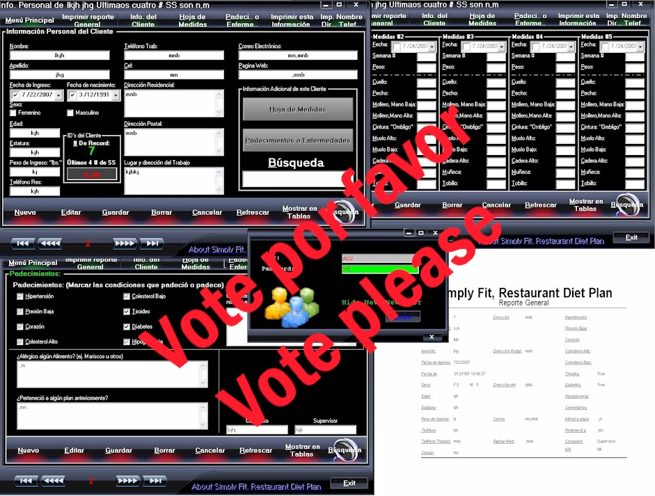

## Data base using Access&\#8230; Complete Application\.\. interface\.

### Description

Base de Dato para clientes utilizando Access, Interfase grafica. =  Data base using Access&#8230;

Unzip the file in this directory &#8220;C:\&#8221; likes that the Data Base would be reed by ADO.

USER: ALU PASSWORD: ALU if it does not work inside is a manual make in flash and written a manual.

Descomprime el archivo en el directorio &#8220;C:\ &#8220;de esa manera la base de dato puede ser le&#237;da por ADO.

USER: ALU PASSWORD: ALU si no funciona dentro hay un manual el flash y escrito.
 
### More Info
 

             |
---                |---
**Submitted On**   |2007-07-25 00:10:00
**By**             |[Ruben Arocho](https://github.com/Planet-Source-Code/PSCIndex/blob/master/ByAuthor/ruben-arocho.md)
**Level**          |Intermediate
**User Rating**    |4.8 (63 globes from 13 users)
**Compatibility**  |VB 5\.0, VB 6\.0
**Category**       |[Databases/ Data Access/ DAO/ ADO](https://github.com/Planet-Source-Code/PSCIndex/blob/master/ByCategory/databases-data-access-dao-ado__1-6.md)
**World**          |[Visual Basic](https://github.com/Planet-Source-Code/PSCIndex/blob/master/ByWorld/visual-basic.md)
**Archive File**   |[Data\_base\_2077467292007\.zip](https://github.com/Planet-Source-Code/ruben-arocho-data-base-using-access-8230-complete-application-interface__1-69075/archive/master.zip)

